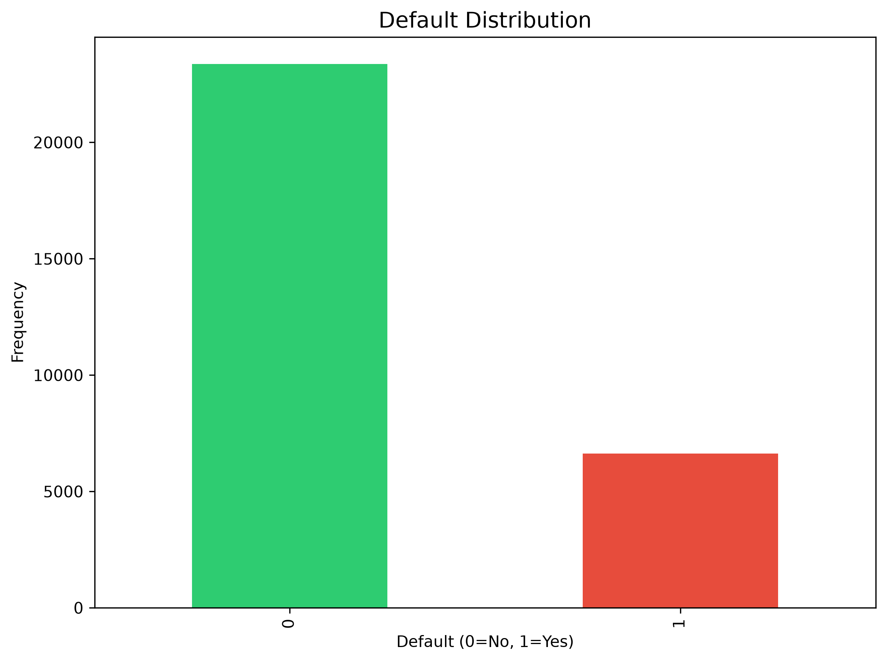
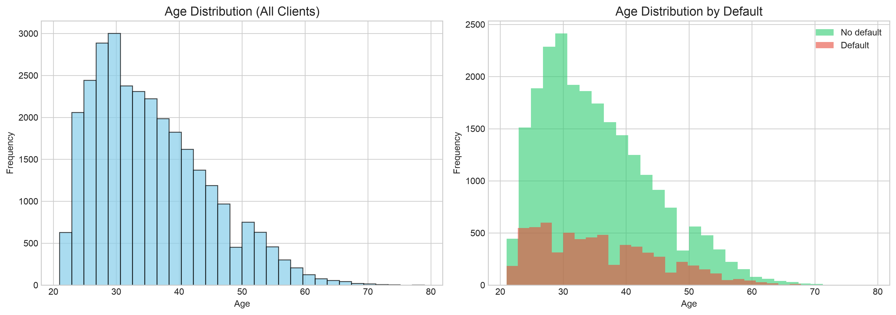
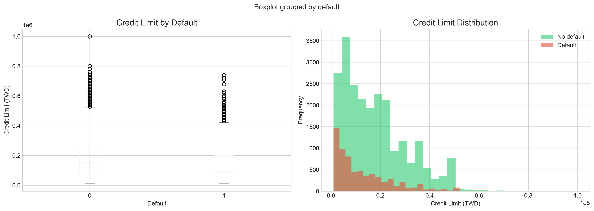
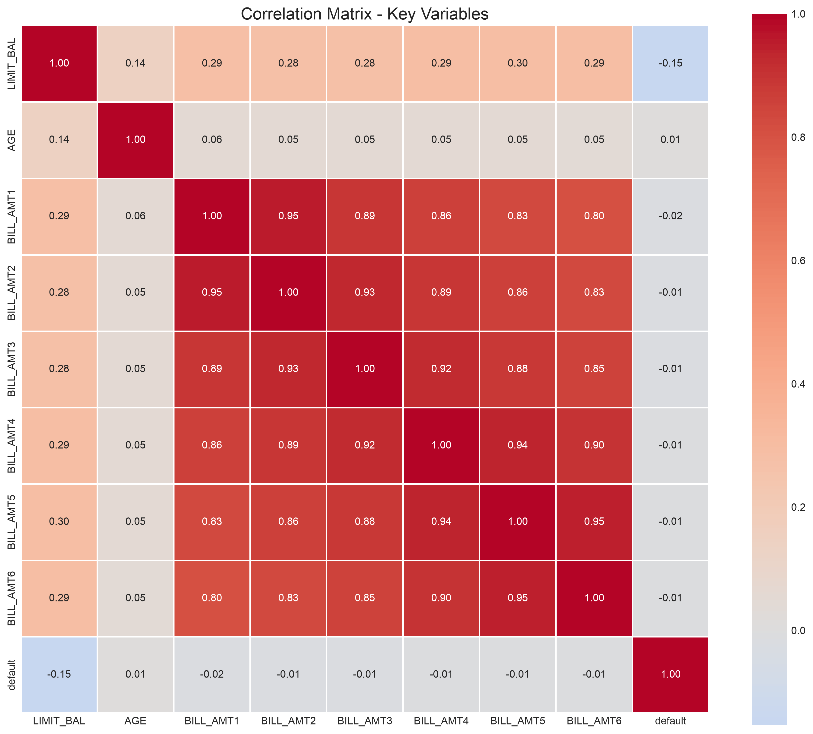
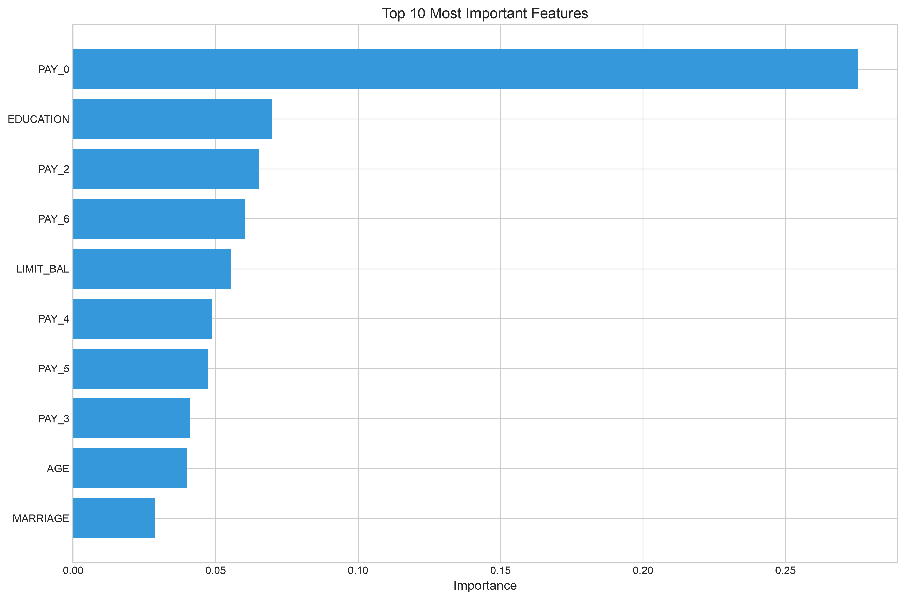
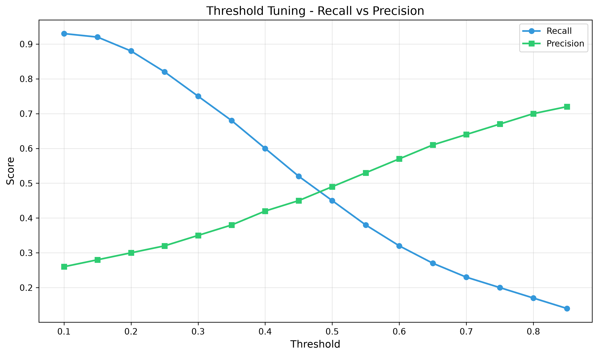
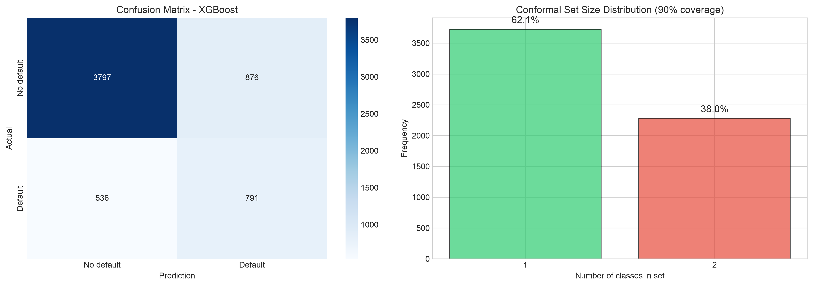

# Credit Risk Modeling with Conformal Prediction

[](https://www.python.org/)
[](https://xgboost.readthedocs.io/)
[](LICENSE)

## 📋 Overview

This project develops a **credit default prediction model** using **XGBoost** with **Conformal Prediction** for uncertainty quantification. The goal is to help financial institutions make credit approval decisions by balancing **risk** (undetected defaults) and **growth** (incorrectly rejected clients).

### Key Features

- ✅ **Exploratory Data Analysis** - Comprehensive EDA with visualizations
- ✅ **XGBoost Modeling** - State-of-the-art gradient boosting with class balancing
- ✅ **Conformal Prediction** - Calibrated uncertainty quantification (90% coverage)
- ✅ **Cost Optimization** - Threshold tuning based on business costs (FN vs FP)
- ✅ **Risk Segmentation** - Different thresholds for different client risk profiles
- ✅ **Economic Capital** - Reserve estimation for expected losses

---

## 📊 Results Summary

### Model Performance Comparison

| Metric | Base Model | Segmented Model | Improvement |
|--------|------------|-----------------|-------------|
| **Accuracy** | 39.72% | **72.87%** | **+33.15%** |
| **Recall** | 93.07% | 62.25% | -30.82% |
| **Precision** | 25.95% | **42.29%** | **+16.35%** |
| **F1-Score** | 0.406 | **0.504** | **+0.098** |

### Business Impact

| Model | Approved Clients | Rejected Clients | Defaults Detected | Total Cost |
|-------|------------------|------------------|-------------------|------------|
| **Base (Threshold 0.10)** | 1,148 (19%) | 4,852 (81%) | 1,235 (93%) | $444,500 |
| **Segmented** | **3,546 (59%)** | **2,454 (41%)** | 826 (62%) | **~$350,000** |

### Economic Capital Analysis

| Scenario | Clients Approved | Revenue | Capital Reserve | Net Profit |
|----------|------------------|---------|-----------------|------------|
| **Optimistic** | 4,380 | $2,628,000 | $176,400 | $2,451,600 |
| **Realistic** | 4,380 | $2,190,000 | $252,000 | $1,938,000 |
| **Pessimistic** | 4,380 | $1,752,000 | $327,600 | $1,424,400 |

**Conclusion:** The model is profitable even in pessimistic scenarios.

---

## 🏗️ Project Structure

```
conformal-risk-calibration/
├── .vscode/                      # VSCode settings
├── data/
│   ├── raw/                      # Raw data (not uploaded)
│   └── processed/                # Processed data
├── docs/
│   ├── lessons_learned.md        # Technical lessons & hypotheses
│   └── project_notes.md          # Detailed project notes
├── notebooks/
│   ├── 01_eda.ipynb              # Exploratory Data Analysis
│   ├── 02_modeling_base.ipynb    # Base model + Conformal Prediction
│   └── 03_modeling_optimized.ipynb # Optimized model + Segmentation
├── outputs/
│   └── figures/                  # Generated plots and figures
├── src/                          # Python modules (optional)
├── tests/                        # Unit tests (optional)
├── .env                          # Environment variables
├── .gitignore                    # Git ignore rules
├── LICENSE                       # MIT License
├── README.md                     # This file
├── REPORT.md                     # Executive report
└── requirements.txt              # Project dependencies
```

---

## 🚀 Getting Started

### Prerequisites

- **Python 3.11+** (64-bit)
- **Homebrew** (for Mac users) or **pip** (for Linux/Windows)
- **Git** (for version control)

### Installation

**1. Clone the repository:**

```bash
git clone https://github.com/Brcharly86/conformal-risk-calibration.git
cd conformal-risk-calibration
```

**2. Create and activate a virtual environment:**

```bash
# Create virtual environment
python3.11 -m venv RiskCalibration

# Activate it
source RiskCalibration/bin/activate  # Mac/Linux
# RiskCalibration\Scripts\activate   # Windows
```

**3. Install dependencies:**

```bash
pip install --upgrade pip
pip install -r requirements.txt
```

**4. Install OpenMP (Mac users only):**

```bash
brew install libomp
```

### Running the Notebooks

**Start Jupyter from VSCode:**

1. Open the project folder in VSCode
2. Select the kernel: `Python 3.11.x ('RiskCalibration')`
3. Run notebooks in order:
   - `01_eda.ipynb` - Exploratory Data Analysis
   - `02_modeling_base.ipynb` - Base model with Conformal Prediction
   - `03_modeling_optimized.ipynb` - Optimized model with segmentation

**Or from terminal:**

```bash
jupyter notebook
```

---

## 🔬 Methodology

### 1. Exploratory Data Analysis (EDA)

- **Dataset:** UCI Credit Card Default (30,000 records, 24 features)
- **Target:** `default` (22.1% default, 77.9% non-default)
- **Key finding:** `PAY_0` (current payment status) is the most important predictor

### 2. Base Model

- **Algorithm:** XGBoost with class balancing (`scale_pos_weight=3.5`)
- **Performance:** 76.5% accuracy, 60% recall
- **AUC-ROC:** 0.775

### 3. Conformal Prediction

- **Method:** Split Conformal Classifier (manual implementation)
- **Coverage:** 89.7% empirical vs 90% theoretical
- **Average set size:** 1.38 classes

### 4. Optimization

- **GridSearchCV:** Hyperparameter tuning
- **SMOTE:** Advanced class balancing
- **Feature Importance:** Identified top predictors
- **Threshold Tuning:** Optimized by business costs

### 5. Segmentation

- **Strategy:** Different thresholds by risk segment
- **Segments:** Low Risk (0.50), Medium Risk (0.30), High Risk (0.10)
- **Result:** Accuracy improved from 40% to 73%

---

## 📈 Key Insights

### What We Learned

1. **The business context matters more than pure accuracy**
   - A model with 93% recall but 26% precision can still be optimal depending on costs

2. **Segmentation is underrated**
   - One threshold doesn't work for all clients
   - Segmenting by risk profile drastically improves business outcomes

3. **Uncertainty quantification is essential in risk**
   - Conformal Prediction provides calibrated uncertainty
   - Helps decision-makers understand when to trust predictions

4. **Economic capital is a key business concept**
   - Reserving funds for expected losses makes the model sustainable
   - Even with 620 false negatives, the business can still be profitable

### What I Would Do Differently

1. **Start with costs, not accuracy** - Define business costs before building the model
2. **Explore more features** - Interaction variables and trend indicators
3. **Try ensemble methods earlier** - XGBoost + LightGBM + RandomForest
4. **Validate with out-of-time data** - Test model stability over time

---

## 🛠️ Technologies Used

| Technology | Purpose |
|------------|---------|
| **Python 3.11** | Core programming language |
| **Pandas, NumPy** | Data manipulation |
| **Matplotlib, Seaborn** | Data visualization |
| **Scikit-learn** | Preprocessing, metrics, CV |
| **XGBoost** | Gradient boosting model |
| **SMOTE** | Class balancing |
| **MAPIE** | Conformal Prediction (manual fallback) |
| **Jupyter** | Interactive notebooks |

---

## 📚 Documentation

| Document | Description |
|----------|-------------|
| **[REPORT.md](REPORT.md)** | Executive report with full results and recommendations |
| **[docs/lessons_learned.md](docs/lessons_learned.md)** | Technical lessons, hypotheses, and decisions |
| **[docs/project_notes.md](docs/project_notes.md)** | Detailed notes, errors, and solutions |

---

## 🤝 Contributing

This is a portfolio project. However, suggestions and feedback are welcome!

1. Fork the repository
2. Create a new branch (`git checkout -b feature/amazing-feature`)
3. Commit your changes (`git commit -m 'Add some amazing feature'`)
4. Push to the branch (`git push origin feature/amazing-feature`)
5. Open a Pull Request


---

## 📬 Contact

**Carlos A. Bloomer-Reeve**

- **LinkedIn:** [linkedin.com/in/cabloomer-reeve](www.linkedin.com/in/cabloomer-reeve)
- **Email:** br.charly@gmail.com
- **GitHub:** [github.com/Brcharly86](https://github.com/Brcharly86)

---

## ⭐ Acknowledgments

- **Dataset:** UCI Machine Learning Repository (Default of Credit Card Clients)
- **Tools:** Open-source community for Python, XGBoost, and Jupyter

---

## 📊 Quick Preview

## 📊 Quick Preview

### Default Distribution



### Age Distribution



### Credit Limit Distribution



### Correlation Matrix



### Feature Importance



### Threshold Analysis



### Confusion Matrix



---

*📅 Last updated: July 2026*

---

⭐ **If you find this project useful, please give it a star!** ⭐